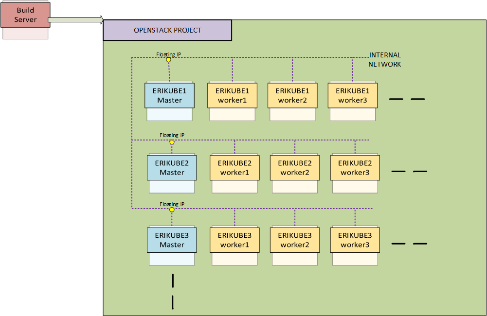

# Deploying Erikube on Openstack with terraform



[TOC]

## Getting Started
Script to automate the deployment of erikube onto an openstack environment using terraform.
It is designed to be run from a build server external to the cloud
There are two terraform scripts included.

Pre-requsites:
- create security group with open access
- upload centos image
- create custom flavors
- create internal networks
- create openstack router

build-erikube.tf does the following:
- build the VMs and config with cloud-init from eccd-cloud-config file
- create ansible inventory 
- deploy erikube/eccd using standard ansible scripts
- [ optional ] run custom post steps 


## Prerequisites

Build server
- centos 7 OS:
- ansible (yum install ansible -y)
- terraform 
- git 
- erikube ansible scripts

Openstack Project Mininuim Quota:
- instance: > 4
- RAM > 50GB
- Storage > 400GB
- CPU > 32 
- Floating IP > 1
- Security groups > 1


You will need the cred file (openrc.sh) of the openstack project that you wish to use.

Ensure  the  build server's ssh key added to your gerrit-gamma.gic.ericsson.se account profile

## Deploy
### Setup build server
```
  $ yum install ansible git python-pip gcc python-devel wget -y
  $ sudo pip install --upgrade pip
  $ sudo pip install python-openstackclient
  $ wget https://releases.hashicorp.com/terraform/0.11.1/terraform_0.11.1_linux_amd64.zip  && unzip terraform_0.11.1_linux_amd64.zip -d /usr/local/bin
  $ sudo chmod +x /usr/local/bin/terraform
  $ wget https://arm.rnd.ki.sw.ericsson.se/artifactory/proj-erikube-generic-local/erikube/releases/eccd-1.0.0-64-da250a7-x86_64.tgz | tar xvf -C ~
  ### Download cred from openstack project
  $ source openrc.sh
  ### Ensure ssh keys of build server are included in git account profile.
  $ git clone ssh://<signum>@gerrit-gamma.gic.ericsson.se:29418/AIA/CI/infra
  $ cd ./infra/terraform/openstack-erikube

```

## Check Pre-requisites

--- needs more info here ---
The external network information needs to be update for the cloud environment that you are using and can be retrieved using the following command:

```
$ neutron  net-external-list -c name -c id 
neutron CLI is deprecated and will be removed in the future. Use openstack CLI instead.
+--------------------+--------------------------------------+
| name               | id                                   |
+--------------------+--------------------------------------+
| admin_floating_net | 521c873d-bdbd-4802-a56f-026a3a122c3d |
+--------------------+--------------------------------------+

```


### Run build erikube

The following variables can be edit in the var-build-erikube.tf  file

 variable |  default | description
 ---|---|---
worker-count       |3    | The number of kube mins to be deploy, 3 min for rook
erikube-ansible-dir| ~/eccd-1.0.0-64-da250a7  | Location of erikube/eccd ansible files
erikube-securitygroup      | open | Security group to be used , needs to be predefined on openstack
erikube-image   | centos7-1708   | Image to be used , needs to be upload to glance
erikube-flavor| aia.eccd.flavor| Flavor to be used ,  needs to be predefined on openstack
external-network| TBD | External network name ,  needs to be predefined on openstack
internal-network| TBD | Internal network name,  needs to be predefined on openstack
erikube-keypair| TBD | Keypair to be used for erikube/eccd VMs,  needs to be predefined on openstack
post-steps | true | optional custom post steps. ansible playbooks that can be run post eccd playbook

Variables can also be set in the commad line
i.e terraform apply -var 'worker-count=6'

Switch to new workspace, the workspace name will be used in the kube VM names.


```
  $  terraform workspace new eccd1
  #### Always good to check what workspace you are in
  $ terform workspace list 
  $  terraform apply
```

Install takes 20-30 mins

## Verify
To verify the erikube environment check kube system
 ```
 $ kubectl get pod -n kube-system
NAME                                                READY     STATUS    RESTARTS   AGE
calico-node-5pdhf                                   2/2       Running   0          8d
calico-node-c944b                                   2/2       Running   0          8d
calico-node-s4hq2                                   2/2       Running   0          8d
calico-node-x3431                                   2/2       Running   0          8d
calico-policy-controller-955282991-8slcz            1/1       Running   0          8d
dashboard-with-authn                                2/2       Running   0          8d
erikubeingressctrl-2476946923-8ggxf                 1/1       Running   0          8d
kube-apiserver-erikube1-master.novalocal            1/1       Running   0          8d
kube-controller-manager-erikube1-master.novalocal   1/1       Running   9          8d
kube-dns-1064890499-qvv84                           3/3       Running   0          8d
kube-proxy-0p90d                                    1/1       Running   0          8d
kube-proxy-jc93j                                    1/1       Running   0          8d
kube-proxy-sk7cj                                    1/1       Running   0          8d
kube-proxy-vx7n9                                    1/1       Running   0          8d
kube-scheduler-erikube1-master.novalocal            1/1       Running   4          8d
tiller-deploy-2117299828-1zhf7                      1/1       Running   0          8d

 ```

Check ROOK
```
 $ kubectl get pod -n rook
 NAME                              READY     STATUS    RESTARTS   AGE
rook-api-3585095780-bpq65         1/1       Running   0          8d
rook-ceph-mgr0-2433831532-5145c   1/1       Running   0          8d
rook-ceph-mon1-lc180              1/1       Running   0          8d
rook-ceph-mon3-njvzm              1/1       Running   1          7d
rook-ceph-mon4-5sn01              1/1       Running   0          7d
rook-ceph-mon5-k3qkz              1/1       Running   0          7d
rook-ceph-osd-0ppln               1/1       Running   0          8d
rook-ceph-osd-6257g               1/1       Running   0          8d
rook-ceph-osd-6lg3c               1/1       Running   0          8d
rook-ceph-osd-sd29t               1/1       Running   0          8d

```


## Destroy erikube
```
  #### Always good to check what workspace you are in
  $ terform workspace list 
  ## as safety percauition check current state 
  $  terraform show  
  $  terraform destroy
```
