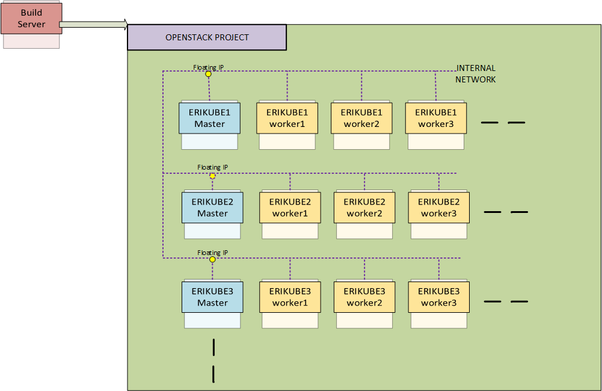

# Deploying Erikube on Openstack with terraform



[TOC]

## Getting Started
Script to automate the deployment of erikube onto an openstack environment using terraform.
It is designed to be run from a build server external to the cloud
There are two terraform scripts included.

Pre-req does the following:
- create security group
- upload centos image
- create custom flavors
- create internal networks
- create openstack router

Deploy-erikube does the following:
- build the VMs and config with cloud-init
- create ansible invetory 
- deploy erikube using standard ansible scripts
- run post steps to install rook, install helm client, install monitoring, etc

The reason that it is split into two phases is that an erikube deployment can be destroyed without impacting the pre-req, which would impact other erikube deployments in the project that relied on them.

## Prerequisites

Build server
- centos 7 OS:
- ansible (yum install ansible -y)
- terraform 
- git 
- erikube ansible scripts

Openstack Project Mininuim Quota:
- instance: > 4
- RAM > 50GB
- Storage > 400GB
- CPU > 32 
- Floating IP > 4
- Security 


You will need the cred file (openrc.sh) of the openstack project that you wish to use.

Ensure  the  build server's ssh key added to your gerrit-gamma.gic.ericsson.se account profile

## Deploy
### Setup build server
```
  $ yum install ansible git python-pip gcc python-devel wget -y
  $ sudo pip install --upgrade pip
  $ sudo pip install python-openstackclient
  $ wget https://releases.hashicorp.com/terraform/0.11.1/terraform_0.11.1_linux_amd64.zip  && unzip terraform_0.11.1_linux_amd64.zip -d /usr/local/bin
  $ sudo chmod +x /usr/local/bin/terraform
  $ wget https://arm.rnd.ki.sw.ericsson.se/artifactory/proj-erikube-generic-local/erikube/releases/erikube-0.3.2-1704-x86_64.tgz | tar xvf -C ~
  ### Download cred from openstack project
  $ source openrc.sh
  ### Ensure ssh keys of build server are included in git account profile.
  $ git clone ssh://<signum>@gerrit-gamma.gic.ericsson.se:29418/AIA/CI/infra
  $ cd ./infra/terraform/deploy-erikube

```

### Run Pre-req
The following variables can be edited in the pre-req/var-pre-req.tf  file

 variable |  default | description
 ---|---|---
erikube-disk       |100                 | The Disk size to be used in erikube flavor
erikube-vcpu       |4                   | The CPU to be used in erikube flavor
erikube-ram        | 16384              | The RAM to be used in the erikube flavor
external-network   | TBD                | The external network name
external-network-id| TBD                | The external network ID
nameserver         | 159.107.189.59   | Local DNS server to be used


The external network information needs to be update for the cloud environment that you are using and can be retrieved using the following command:

```
$ neutron  net-external-list -c name -c id 
neutron CLI is deprecated and will be removed in the future. Use openstack CLI instead.
+--------------------+--------------------------------------+
| name               | id                                   |
+--------------------+--------------------------------------+
| admin_floating_net | 521c873d-bdbd-4802-a56f-026a3a122c3d |
+--------------------+--------------------------------------+

```


The variables can also be set in the commad line
i.e  -var 'erikube-ram=20'

The pre-req only needs to be run once per project

```
  $  terraform init 
  $ terraform workspace new pre-req
  $  terraform apply ./pre-req/
```

### Run build erikube

The following variables can be edit in the pre-req/var-pre-req.tf  file

 variable |  default | description
 ---|---|---
worker-count       |3    | The number of kube mins to be deploy, 3 min for rook4
erikube-ansible-dir| ~/erikube-0.3.2-1704  | Location of erikube ansible files
erikube-securitygroup      | erikube-open | Security group to be used , hardcoded to match pre-req
erikube-image   | centos7-1708-erikube   | Image to be used , hardcoded to match pre-req
erikube-flavor| erikube-flavor | Flavor to be used , hardcoded to match pre-req
erikube-flavor| TBD | External network name, should be set to whatever was used in pre-req

Again variables can also be set in the commad line
i.e terraform apply -var 'worker-count=6'

Switch to new workspace, the workspace name will be used in the kube VM names.


```
  $  terraform workspace new erikube-test
  #### Always good to check what workspace you are in
  $ terform workspace list 
  $  terraform apply
```

Install takes 15-20 mins

## Verify
To verify the erikube environment you should be able to 
- kube-dash
  https://floating-ip:30300/
  admin/ericsson

- grafana
  http://floating-ip:30310
  admin/admin

-  prometheus
   http://floating-ip:30320

- AlertManager
  http://floating-ip:30330

 ssh floating-ip
 
 centos/centos

Check kube system
 ```
 $ kubectl get pod -n kube-system
NAME                                                READY     STATUS    RESTARTS   AGE
calico-node-5pdhf                                   2/2       Running   0          8d
calico-node-c944b                                   2/2       Running   0          8d
calico-node-s4hq2                                   2/2       Running   0          8d
calico-node-x3431                                   2/2       Running   0          8d
calico-policy-controller-955282991-8slcz            1/1       Running   0          8d
dashboard-with-authn                                2/2       Running   0          8d
erikubeingressctrl-2476946923-8ggxf                 1/1       Running   0          8d
kube-apiserver-erikube1-master.novalocal            1/1       Running   0          8d
kube-controller-manager-erikube1-master.novalocal   1/1       Running   9          8d
kube-dns-1064890499-qvv84                           3/3       Running   0          8d
kube-proxy-0p90d                                    1/1       Running   0          8d
kube-proxy-jc93j                                    1/1       Running   0          8d
kube-proxy-sk7cj                                    1/1       Running   0          8d
kube-proxy-vx7n9                                    1/1       Running   0          8d
kube-scheduler-erikube1-master.novalocal            1/1       Running   4          8d
multus-controller-t8zr0                             1/1       Running   0          8d
multus-node-366r0                                   1/1       Running   0          8d
multus-node-9zb4g                                   1/1       Running   0          8d
multus-node-f0s2p                                   1/1       Running   0          8d
multus-node-h6s01                                   1/1       Running   0          8d
tiller-deploy-2117299828-1zhf7                      1/1       Running   0          8d

 ```

Check ROOK
```
 $ kubectl get pod -n rook
 NAME                              READY     STATUS    RESTARTS   AGE
rook-api-3585095780-bpq65         1/1       Running   0          8d
rook-ceph-mgr0-2433831532-5145c   1/1       Running   0          8d
rook-ceph-mon1-lc180              1/1       Running   0          8d
rook-ceph-mon3-njvzm              1/1       Running   1          7d
rook-ceph-mon4-5sn01              1/1       Running   0          7d
rook-ceph-mon5-k3qkz              1/1       Running   0          7d
rook-ceph-osd-0ppln               1/1       Running   0          8d
rook-ceph-osd-6257g               1/1       Running   0          8d
rook-ceph-osd-6lg3c               1/1       Running   0          8d
rook-ceph-osd-sd29t               1/1       Running   0          8d

```


## Destroy erikube
```
  #### Always good to check what workspace you are in
  $ terform workspace list 
  ## as safety percauition check current state 
  $  terraform show  
  $  terraform destroy
```

## Clean up project 
```
  #### Always good to check what workspace you are in
  $ terform workspace select  pre-req
  ## as safety percauition check current state 
  $  terraform show  
  $  terraform destroy ./pre-req
```
